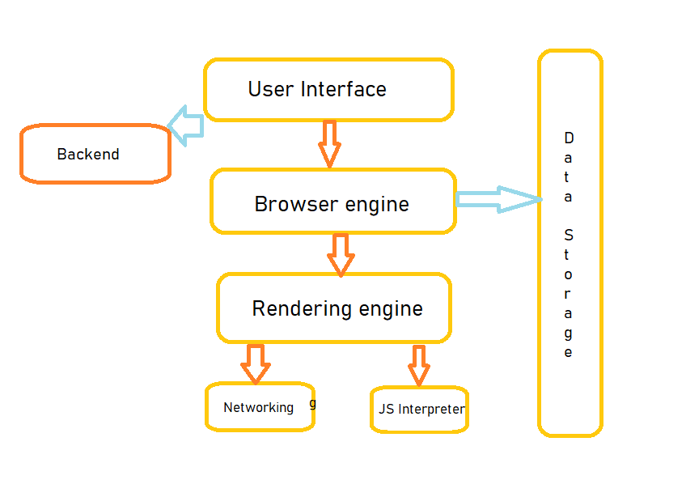

# Week One Assigment

---

 
 

Exercise 1.1

When a user enters an URL in the browser, how does the browser fetch the desired result ?

The main function of a browser is to present the web resource we choose, by requesting it from the server and displaying it in the browser window. 

The browser's main components are:
The user interface, The browser engine, The rendering engine, Networking, JavaScript interpreter, Data storage

<ol>
<li>First The Browser, checks the cache for a DNS record to find the corresponding IP address. To find the DNS record, the browser checks four caches.
    <ul>
    <li>it checks the browser cache</li>
    <li>it checks the OS cache</li>
    <li>it checks the router cache</li>
    <li>it checks the ISP cache</li>
    </ul>
</li>
<li>If the requested URL is not in the cache, ISP’s DNS server initiates a DNS query to find the IP address of the server that hosts the URL
</li>
<li>The browser initiates a TCP connection with the server and Once the TCP connection is established, The browser sends an HTTP request to the webserver.</li>
<li>The server handles the request and sends back a HTTP response</li>
</ol>

After Finishing requesting, Browser Parse the HTML Document. First, it will render the bare bone HTML skeleton. Then it will check the HTML tags and send out GET requests for additional elements on the web page, such as images, CSS stylesheets, JavaScript files, etc

These static files are cached by the browser, for faster processing and then we see the requested web page in the browser.

